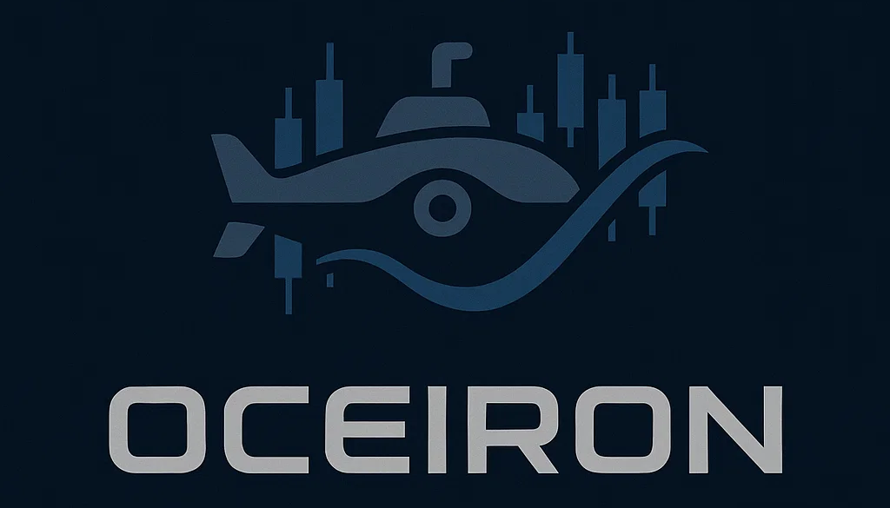
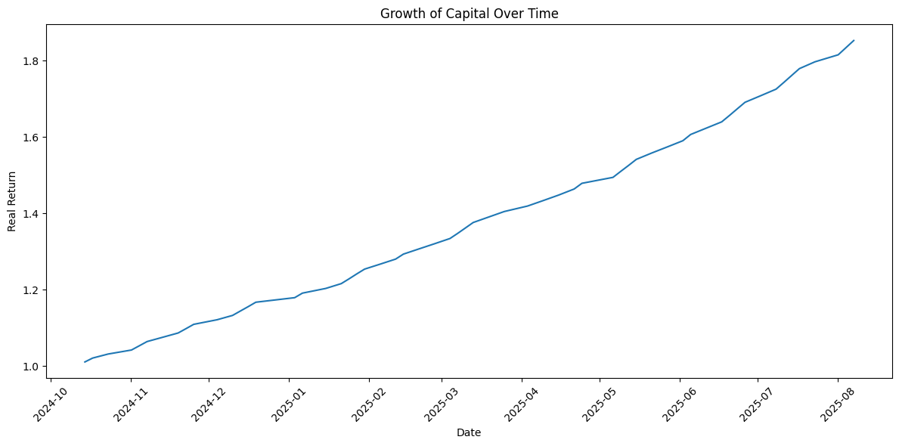

#Oceiron — Prototype Trading Bot

This repository contains a prototype of a trading bot that builds portfolios every 3 days based on model predictions.
The strategy is backtested from October 14, 2024 to August 7, 2025, achieving a cumulative growth of:

📊 Capital multiplier: x1.85

💰 Total growth: +85.25%

⏱ Period: ~10 months

| Date             | Tickers (selection)                                                                | Retorno\_Real |
| ---------------- | ---------------------------------------------------------------------------------- | ------------- |
| 14/10/2024 04:00 | DG, ECVT, GRPN, DIT, ACHR, CLW, IRTC, PINE, MARA, CBOE, GPC, KMX, FRGE, STRA, SPR… | 1.0103        |
| 01/08/2025 04:00 | CLX, KRC, QS, PINE, UAL, PPL, UNH, CVLT, HOUS, FLO, AUR, EPSN, KIM, GSAT, CB, DOC… | 1.8151        |
| 04/08/2025 04:00 | SD, EG, LEA, MCEM, IRT, NCSM, PRDO, BRK-B, SAH, NSA, FAST, KNOP, CLX, DVN, CENX…   | 1.8338        |
| 07/08/2025 04:00 | GILD, MCEM, VHI, EFC, V, EQT, ALVO, HBAN, NGVC, MAIN, ZION, RNR, HESM, UCB, SFBS…  | 1.8525        |

[Test file with all generated portfolios](test.csv)

Notes

Returns are based on historical data.

No transaction costs, slippage, or liquidity constraints are included.

This project is an experimental prototype, intended for research and portfolio purposes only.
